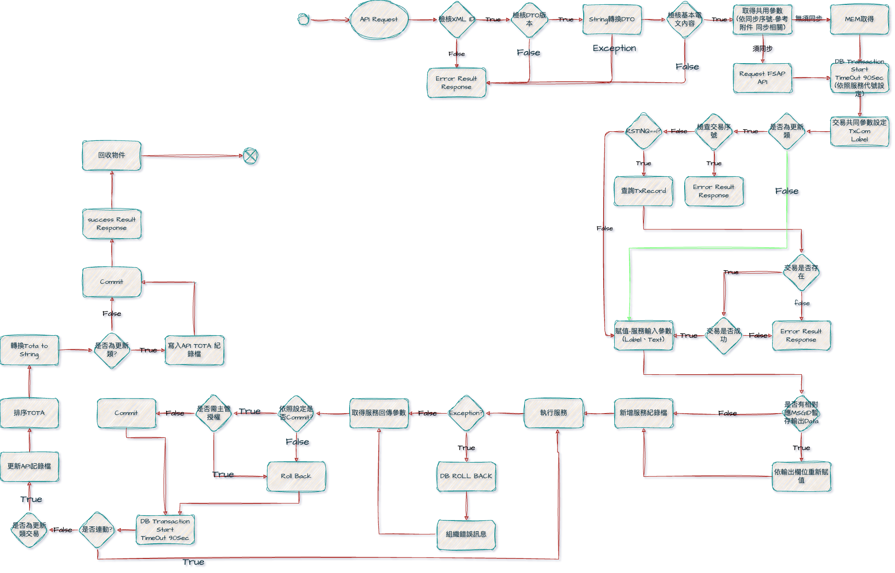
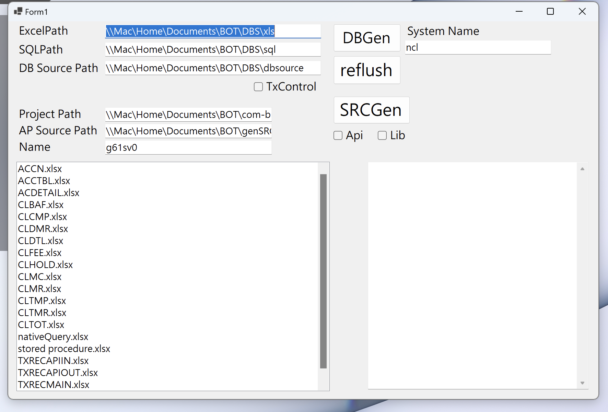
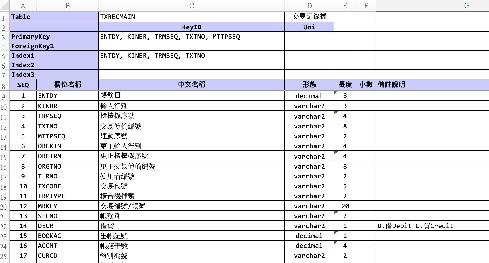
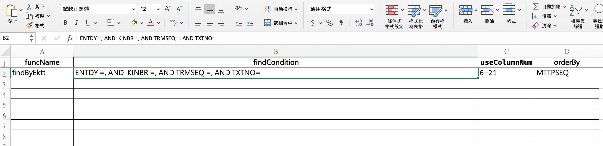
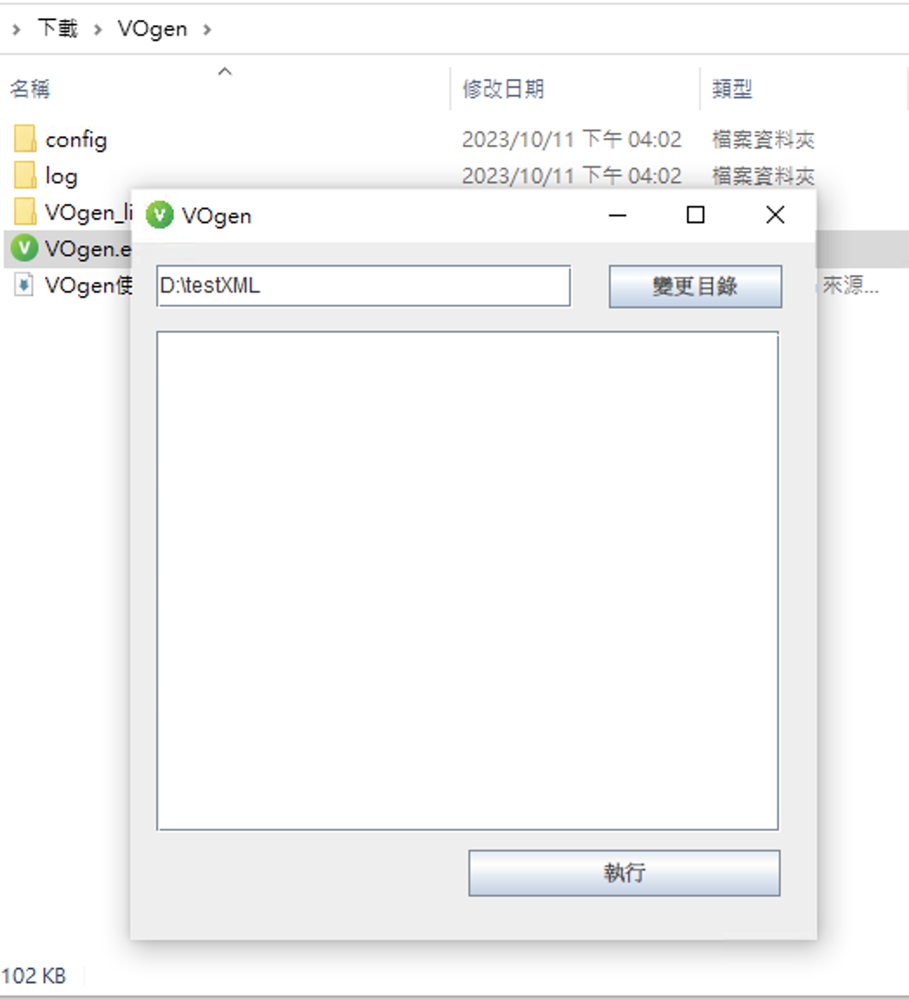
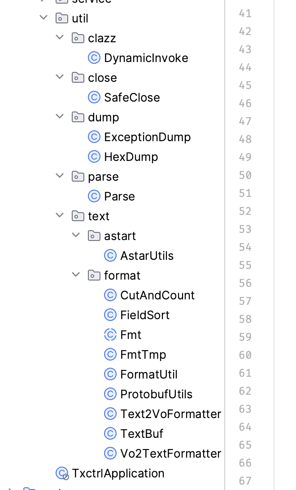
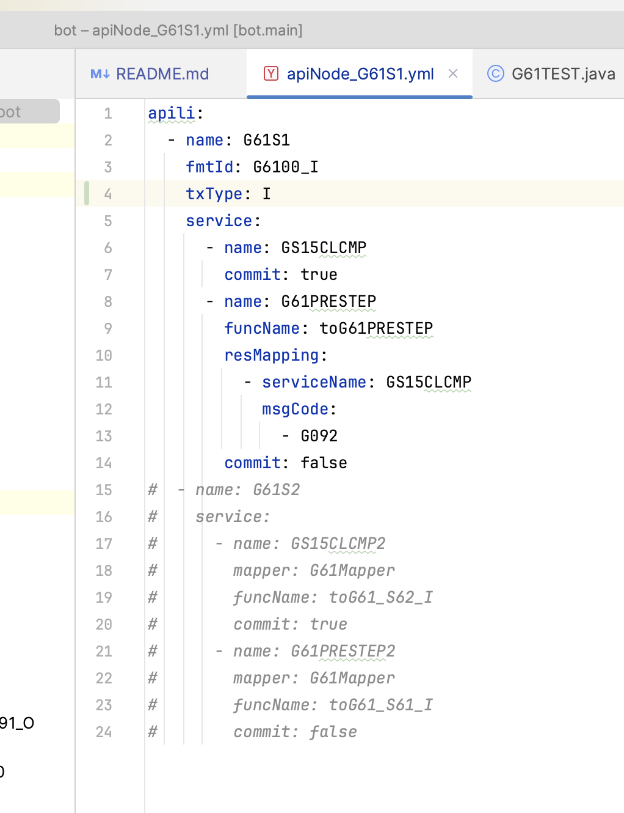
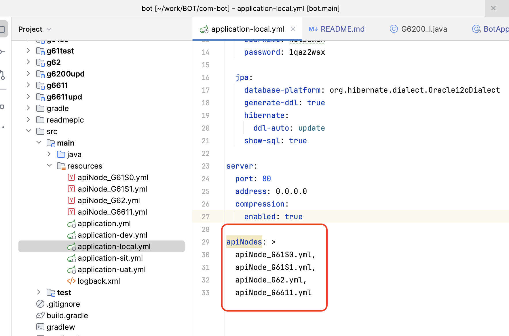

# Main Project 
### com-bot
#### 
# Env Setting
### Install JDK azul 17
### Install IntelliJ lombok Plugins
### log文件輸出位置
### src/main/resource/logback.xml : \<property name="BOT_NCL_LOG" value="/Users/adam/work/BOT/log"/> (本機環境)

# New Service or Api Project
## 透過工具產生
### 使用工具DBGen產生或是自行建立New Module
### Download [DotNet 6.0](https://dotnet.microsoft.com/en-us/download/dotnet/thank-you/runtime-desktop-6.0.21-windows-x64-installer)
### Download [DBGen](https://drive.google.com/file/d/1CCA7T15MkkUubkmLffdGuX8hj29K-p9y/view?usp=share_link)
### 
- #### ExcelPath 
      指定DB Excel 所在資料夾位置
- #### SQLPath 
      請指定產生之 SQL 資料夾
- #### DB Source Path 
      請指定產生 DBS 資料夾
- #### Project Path 
      專案路徑
- #### AP Source Path
       Service or Api 產生路徑
- #### Name
       Service or Api 專案名稱
- #### System Name
       系統名稱 ex. ncl fac
- #### DBGen
       產生DB Source Code
- #### SRCGen
       產生service or Api 基礎程式
- #### reFlush 
       重新整理讀取Excel資料夾
- #### TxControl
  - [x] TxControl 產生適用於 TxControl 之程式
  - [ ] TxControl 產生適用於 Ncl 之程式
- #### Project Path 請指定父類別專案位置 
  - \\Mac\Home\Documents\BOT\com-bot
- #### Name 請輸入 服務 or Api or Lib 名稱 ex. gs15clcmp
  - [x] Lib ( 產生適用於 Lib 之範本程式 )
  - [ ] Api ( 產生適用於 Api 之範本程式 )
  - 
  - [ ] Lib ( 產生適用於 Lib 之範本程式 )
  - [x] Api ( 產生適用於 Api 之範本程式 )
- #### Excel 欄位範例 
  DBD
  
  DBS
  

    
### 使用VOGen工具產生Value Object或是自行建立
### Download [VOGen](https://drive.google.com/drive/folders/1BUBq4e9G-LX3YlLtJXtiLqalDsM15sEQ?usp=share_link)
### 
- ### 將電文定義檔的 XML 集中在一個目錄下
- ### 執行 VOgen.exe
- ### 按下 `變更目錄` 按鈕
- ### 選擇你置放 XML 的目錄
- ### 在 VOgen 的視窗中 , 選擇你要執行的XML
  - #### 可複選
  - #### 按住 `CTRL` + `滑鼠左鍵` 可個別複選
  - #### 按住 `SHIFT` + `滑鼠左鍵` 可連續複選
- ### 按下 `執行` 按鈕
- ### 等待執行 , 直到出現 `執行完畢` 的提示訊息
- ### 產生出來的 VO Class 文件 會放在原本 `XML` 目錄內的 `VO` 目錄底下

## 子專案分類
- ### Api 
- ### Service 
## 子專案結構
- ### Api
  - #### Input Value Object
    - #### com/bot/ncl/adapter/in/api/
  - #### Output Value Object
    - #### com/bot/ncl/adapter/out/api
  - #### Value Object Mapper
    - #### com/bot/ncl/mapper/
- ### Service
  - #### 交易事件 (可透過工具產生空白範例)
    - #### com/bot/ncl/adapter/event/app/evt/
  - #### 交易監聽器(交易邏輯撰寫位置),(可透過工具產生空白範例)
    - #### com/bot/ncl/adapter/event/app/lsnr/
  - #### Service Input Value Object(可透過工具讀取xml產生)
    - #### com/bot/ncl/adapter/in/svc/
  - #### Service Output Value Object(可透過工具讀取xml產生)
    - #### com/bot/ncl/adapter/out/svc/
- ### Util
  - #### VO && class
    - #### com/bot/(專案名稱)/util/(分類1)/(小分類2)/.../
      
## 撰寫流程說明
- ### 設定參數
  - ### application.yml
        spring.profiles.active 環境設定
  - ### application-(local, dev, uat, sit).yml
        spring.datasource DB相關
        grpc.server.port gRpc 對外Port
        grpc.server.address gRpc 對外ip
        grpc.client.port gRpc 連外Port
        grpc.client.address gRpc 連外ip
        astar.binPath 滿天星Table位置(astar)
  - ### MgGlobal.yml
        MG相關參數預設 (本機測試使用)
        
- ### 撰寫流程Api設定檔
 #### 
- #### apili.name
  - #### Api Name
- #### apili.fmtId
  - #### 電文格式名稱 \<ROWSET TXCODE_FMTID="G6100_I" NAME="全行代理收付業務-連線代收業務-上行電文">
- #### apili.txType
  - #### I 查詢類 U 更新類
- #### apili.service.name
  - #### 服務名稱
- #### apili.service.commit
  - #### 服務結束時，是否先行Commit; true is commit first
- #### apili.service.funcname
  - #### Input Value Object(以下簡稱IV)須透過先前服務的Output Value Object(以下簡稱OV)賦值的Mapper method名稱
- #### apili.service.resMapping.serviceName
  - #### 需取用OV的服務名稱
- #### apili.service.resMapping.msgCode
  - #### 需取用OV的MSGID(同一服務OV會有多筆不同MSGID返回)
- ### 添加流程Api至設定檔
  - 
- ### 使用工具產生範本專案或自行建立專案
- ### 使用工具讀取xml產生Api or Service 的Inpit Output物件
## TxControl Util
- ### ApplicationContext
  - #### ApplicationContextUtil
        ex. ApplicationContextUtil.getBean("text2VoFormatter", Text2VoFormatter.class);
- ### Text 2 Vo
  - #### Text2VoFormatter (使用@Autowired or ApplicationContextUtil.getText2VoFormatter())
        ex. @Autowired Text2VoFormatter text2VoFormatter;
            text2VoFormatter.format(data, request);
            data : byte
            request : value object 
- ### Vo 2 Text
  - #### Vo2TextFormatter (使用@Autowired or ApplicationContextUtil.getVo2TextFormatter())
         ex. @Autowired Vo2TextFormatter vo2TextFormatter;
             String utf8String = vo2TextFormatter.formatRS(responseCase);
             byte[] burBytes = vo2TextFormatter.formatRB(responseCase);
             responseCase : response value object
- ### 轉型
  - #### Parse(使用@Autowired or ApplicationContextUtil.getParse())
    - #### method
      - #### decimal2String(T value) 
            將數字型別(int long float double BigDecimal)轉型為字串，如轉型失敗，回傳值為NULL
      - #### string2BigDecimal(String value) 
            將字串轉型為igDecimal，如轉型失敗，回傳值為NULL
      - #### string2Integer(String value) 
            將字串轉型為Integer，如轉型失敗，回傳值為NULL
      - #### string2Short(String value) 
            將字串轉型為Short，如轉型失敗，回傳值為NULL
      - #### isNumeric(String value) 
            判斷字串是否為數字
- ### 字串切位
  - #### CutAndCount
    - #### method
      - #### CutAndCount.stringCutBaseOnBUR(String text, int sPos, int len)
            以優利碼長度計算切位
      - #### CutAndCount.stringCutBaseOnBig5(String text, int sPos, int len)
            以BIG5長度計算切位
      - #### CutAndCount.stringCutFRB(String text, String code, int byteLen)
            以自訂編碼切位(從0開始算)
- ### Date
  - #### DateUtil(@Autowired or ApplicationContextUtil.getDateUtil())
    - #### method
      - #### int bcToRoc(int value)
            西元年轉民國年 (轉換失敗 return 0)
      - #### int rocToBc(int value)
            民國年轉西元年 (轉換失敗 return 0)
      - #### int getNowIntegerRoc()
            取得系統民國日期整數
      - #### String getNowStringRoc()
            取得系統民國日期字串
      - #### int getNowIntegerForBC()
            取得系統西元日期整數
      - #### String getNowStringBc()
            取得系統西元日期字串
      - #### int getNowIntegerTime(boolean isHaveFemto)
            取得系統時間整數 true HHmmssSSS false HHmmss
      - #### String getNowStringTime(boolean isHaveFemto)
            取得系統時間字串 true HHmmssSSS false HHmmss
## 撰寫規則
- ### 程式與變數命名
  - #### 專案名稱(資料夾)一律小寫
  - #### 交易event與監聽器Class一律大寫並與專案名稱一致，監聽器後綴Lsnr
  - #### IO VO 物件名稱一律大寫並與TXCODE_FMTID相匹配
  - #### Mapper物件一律Mapper開頭並接續api名稱也就是專案名稱全大寫
  - #### 常數 一律大寫
  - #### 私有 小駝峰 class 大駝峰
  - #### DB Entity欄位變數一律小寫(DB本身全大寫)
  - #### 
- ### Log規範
  - #### 於class添加@Slf4j註釋
  - #### ex. ApLogHelper.info(log, false, LogType.TXCONTROL.getCode(), "TBSDY : {}, NBSDY : {}", tbsdy, nbsdy);
    - #### (logger, isSensitive, LogType, msg, ...arguments)
    - #### logger
      - #### logger object
    - #### isSensitive
      - #### true (敏感性資料)
      - #### false (非敏感性資料)
    - #### LogType
      - #### SYSTEM (系統)
      - #### NORMAL (其他)
      - #### UTIL (工具)
      - #### TXCONTROL (Txcontrol)
      - #### APLOG (業務)
      - #### EXCEPTION (錯誤)
      - #### BATCH (批次)
    - #### msg
      - #### 訊息內容
- ### 程式規範
  - #### 所有常數都必須宣告成static final 不可直接寫 \"xxx\"
  - #### 所有常數比較equals()必須反向ex this.HCODE.equals(g6100i.getHcode());
  - #### 變數轉型需透過共用程式Parse進行轉換
  - #### 除了單純整數(日期 Flag 序號....等)，其他數字型態皆需使用BigDecimal
  - #### 業務邏輯相關請撰寫於監聽器